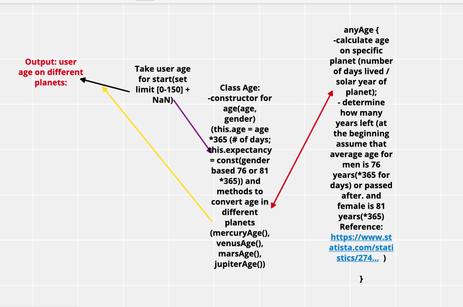
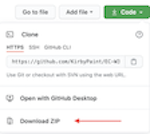

## Super Galactic Age Calculator
#### *Epicodus Independent Project # 5  2/5/2021*
***By Daniel Adeyemi***
___

## *Description*:    
***Ever wondered how old are you on different planets? Well, it's time to find out by using our Galactic Age Calculator***
### This web page will determines user's age based on a planet's solar years (Mercury, Venus, Mars, Jupiter) and also calculate life expectancy on these planets based on gender. Average life expectancy being used: male - 76, female - 81 (*according to 2020 statistics in USA*)

## *Whiteboard of Business Logic*

## *Specs*
    
|  Details| Input  | Output  |  
|:---|:---:|:---:|
|   **Earth(constractor)** | 
|  Should create a object with determined parameters |'Daniel, male, 34'  | 'Daniel, 42, 34' ✅ |   
|  Should create a object with determined parameters |'Amy, female, 34'  | 'Amy, 46, 34' ✅  |    
|   **Mercury** | 
|  Should calculate age in Mercury years | 34 | 8 ✅ | 
|   **Venus** | 
|  Should calculate age in Venus years | 34 | 21 ✅ | 
|   **Mars** | 
|  Should calculate age in Mars years | 34 | 63 ✅ | 
|   **Juniper** | 
|  Should calculate age in Juniper years | 34 | 403 ✅  | 
|  **Mercury Life Expectancy** | 
|  Should calculate how many years left to live for male user on Mercury  | 34, male | 10 ✅ | 
|  Should calculate how many years left to live for female user on Mercury  | 34, female | 11 ✅ | 
|  Should calculate how many years lived over life expectancy on Mercury  | 81, male | 1 ✅ | 
|  **Venus Life Expectancy** | 
|  Should calculate how many years left to live for male user on Venus  | 34, male | 26 ✅ | 
|  Should calculate how many years left to live for female user on Venus  | 34, female | 28 ✅ | 
|  Should calculate how many years lived over life expectancy on Venus | 81, male | 3 ✅ | 
|  **Mars Life Expectancy** | 
|  Should calculate how many years left to live for male user on Mars  | 34, male | 78 ✅ | 
|  Should calculate how many years left to live for female user on Mars  | 34, female | 86 ✅ | 
|  Should calculate how many years lived over life expectancy on Mars  | 81, male | 9 ✅ | 
|  **Juniper Life Expectancy** | 
|  Should calculate how many years left to live for male user on Juniper  | 34, male | 498 ✅ |
|  Should calculate how many years left to live for female user on Juniper  | 34, female | 545 ✅ |  
|  Should calculate how many years lived over life expectancy on Mercury  | 81, male | 59 ✅ | 

## *Running tests from your terminal using Jest and webpack:*
* make sure you have Jest installed, if not, use [this link](https://www.learnhowtoprogram.com/intermediate-javascript/test-driven-development-and-environments-with-javascript/setting-up-jest) to install it on your machine **(also make sure you are in head directory of this project)**
* now from main directory run `$ npm run test` to check if tests from `__test__` directory pass or fail. 
* *(Note: this project has 100% line coverage for business logic with Jest)*

***
## *Setup instructions:*
#### From the web:
* Go to my GitHub repository, using following [URL](https://github.com/DanielAdeyemi/Epicodus_Project5.git).
* Click the "Code"  and click the 'Download zip' option .
* Unzip the file, navigate to the `src` directory.
* open ***'index.html' or any interesting for you file*** to see code.
#### From the terminal: 
* Clone my repository from GitHub using `git clone https://github.com/DanielAdeyemi/Epicodus_Project5.git`
* Navigate to the downloaded folder using ***cd*** command
* Execute **code .** command in your terminal and it will open all source code in your code editor.    
*Note: to run this project locally you will need to have Node. After you cloned and open repository - execute `npm install` in command line to gain access to webpack*
#### GitHub pages:
*GitHub page is unavailable for this project*

## *Tecnologies used:*
* HTML
* CSS
* Java Script
* JQuery
* Bootstrap *v5.0.0 beta*
* Git and GitHub
* Jest
* Webpack
* npm

## *Known bugs:*
This project has almost no style and was used to demonstrate my understanding of TDD and Enviroments in JavaScript.

## *License and copyright:*

> ***© Daniel Adeyemi, 2021***   
> *Licensed under [MIT license](https://mit-license.org/)*